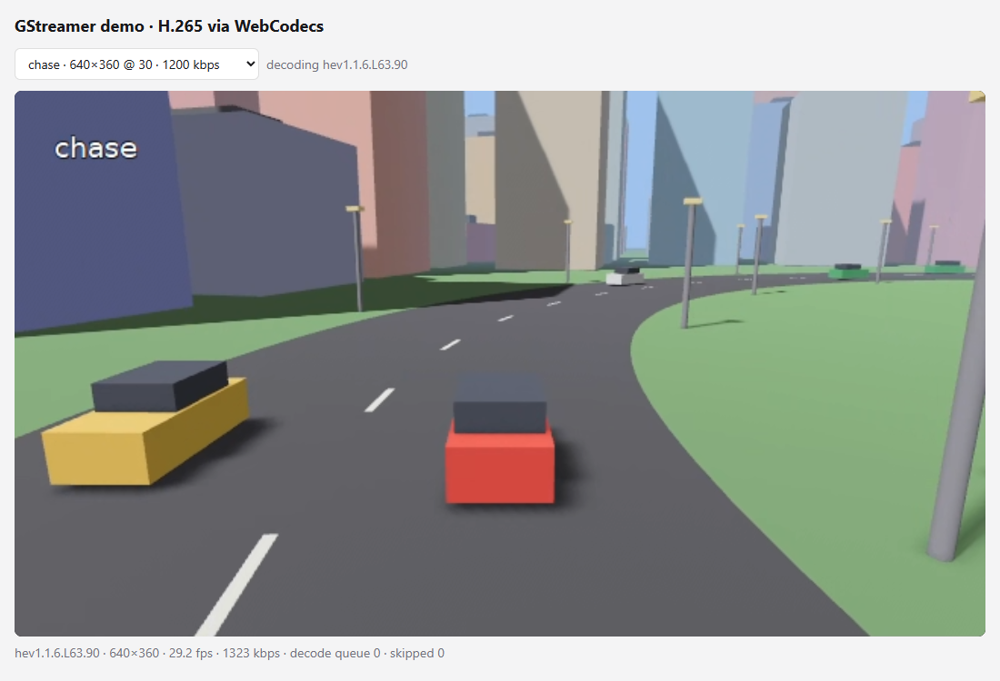

# bevy-streamer: streaming camera views from a Bevy 0.18 game

This is the same idea as [sim-streamer](../sim-streamer/) (a car with six cameras driving through a
synthetic city, streamed as H.265 channels), but the world is a normal **Bevy 0.18.1** app: ECS entities,
PBR materials, a shadow-casting sun, fog, and cameras parented to the car.




## How it's done in Bevy

Yes, you render to a texture. Bevy has everything built in, with no custom render-graph node:

| step | Bevy API | in this demo |
|---|---|---|
| 1. run **headless** | `WindowPlugin { primary_window: None, exit_condition: DontExit }`, `.disable::<WinitPlugin>()`, `ScheduleRunnerPlugin::run_loop(1/fps)` | the app ticks at the stream frame rate with no window |
| 2. **render target image** | `Image::new_target_texture(w, h, Rgba8UnormSrgb, None)` + `TextureUsages::COPY_SRC` | one *atlas* image, 1920×720 |
| 3. **cameras → image** | `RenderTarget::Image(handle.into())` component on each `Camera3d` | all six cameras target the same image |
| 4. **one tile per camera** | `Camera { viewport: Some(Viewport { physical_position, physical_size, .. }), order: i, .. }` | Bevy's split-screen mechanism, aimed at a texture instead of a window |
| 5. **GPU → CPU** | `commands.spawn(Readback::texture(handle)).observe(\|ev: On<ReadbackComplete>\| …)` | Bevy copies the image to the CPU every frame and calls the observer with the bytes |
| 6. **→ GStreamer** | observer pushes the bytes into `appsrc` | shared `gst_demo::atlas` (exactly what sim-streamer uses) encodes the mosaic and per-camera crops |

Other Bevy details worth knowing:

- **Deterministic time.** `TimeUpdateStrategy::ManualDuration(1/fps)` makes `Time` advance exactly one
  video frame per update, so the simulation doesn't depend on wall-clock jitter. `ScheduleRunnerPlugin`
  does the real-time pacing.
- **Camera rig** = children of the car entity (`commands.entity(ego).add_child(camera)`). Bevy's transform
  propagation moves all six cameras with the car. Camera poses are in the car's local frame, where Bevy's
  forward is −Z.
- **Readback rows** are padded to 256 bytes. With a camera width that is a multiple of 64 there is no
  padding; the observer also strips it if present.
- **Readback is asynchronous.** The bytes arrive a frame or two after rendering, which is fine for
  streaming. For exact per-frame metadata (pose, sim time), pair frames with a frame counter.
- **Ctrl+C:** Bevy's `TerminalCtrlCHandlerPlugin` is disabled because the `ctrlc` crate allows only one
  handler per process. The GStreamer thread handles Ctrl+C, then tells Bevy to exit with `AppExit`.
- **Threads:** Bevy owns the main thread, and the GStreamer/GLib main loop (bus, encode-on-demand signals)
  runs on a second thread.

## Run

Prerequisites are the same as the other Rust demos (GStreamer MSVC SDK *devel*, `env.cmd` / `env.ps1`).
Bevy is **not** in the workspace's default members, because its first build takes several minutes, so
build it explicitly:

```bat
cd rust
.\env.cmd
cargo build --release -p bevy-streamer      :: first build ≈ 5 min, later ones ≈ 1–2 min
target\release\bevy-streamer.exe
```

Watch it like any producer:

```bat
target\release\receiver.exe --channel mosaic
```

Or in the browser: `node server.js` in `web/h265-webcodecs`, then <http://localhost:8080/?channel=chase>.

Options: everything from sim-streamer (`--cam-width/--cam-height/--cols/--fps/--cam-kbps/--mosaic-kbps/
--encoder/--gop-seconds/--always-encode/--base-port/--control-port`) plus `--no-shadows`.

Both demos default to ports 5000–5007. To run sim-streamer and bevy-streamer at the same time, give one of
them other ports, e.g. `--control-port 6000 --base-port 6001`, and point receivers at them with
`--control-port 6000`.

## Measured (GTX 1050, Ryzen 5 3600)

| | sim-streamer (raw wgpu) | bevy-streamer |
|---|---|---|
| scene | flat-shaded boxes, fake fog | PBR, 2-cascade sun shadows per camera, fog, MSAA |
| streamed frame rate | 30 fps | 29.5 fps (with the default 30 fps target) |
| code size | ~600 lines (renderer included) | ~350 lines (scene + glue) |
| build time | seconds | minutes (first build) |

The point of comparison: a raw `wgpu` renderer gives full control (synchronous readback, exact timing,
zero-copy later). An engine like Bevy gives you a real scene graph, materials, shadows, assets, and
physics plugins for little code. The streaming side is identical: both push an RGBA atlas into
`gst_demo::atlas::AtlasStream`.

## Files

| file | what |
|---|---|
| [src/main.rs](src/main.rs) | headless app setup, atlas image, camera rig with viewports, `Readback` observer → `appsrc`, exit handling |
| [src/scene.rs](src/scene.rs) | world (road, city, park, traffic, drones, lighting), `Lane` driving system, the six `CameraDef`s |
| [../src/atlas.rs](../src/atlas.rs) | shared GStreamer side: atlas → mosaic + cropped per-camera H.265 channels, control server |

## Going further in Bevy

- **One image per camera** instead of an atlas: give each camera its own `RenderTarget::Image` and
  `Readback`, and push into one `appsrc` per camera. This allows different resolutions and rates per camera.
- **Skip unwatched cameras:** set `Camera::is_active = false` when the control server reports 0 subscribers
  for that channel.
- **Zero-copy:** instead of `Readback`, a render-graph node can hand the `GpuImage` texture to
  NVENC through D3D12/Vulkan interop.
- **Depth or segmentation** for ML: add `DepthPrepass` / custom passes and read them back as raw buffers
  (not video), as discussed in the [sim-streamer README](../sim-streamer/README.md#is-this-the-right-approach).
