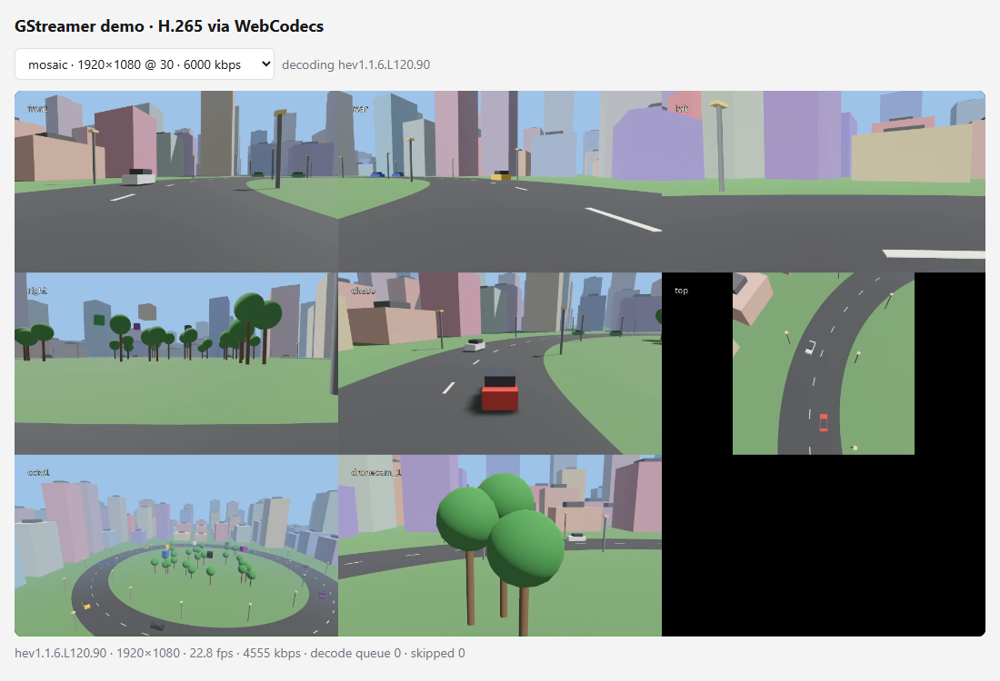
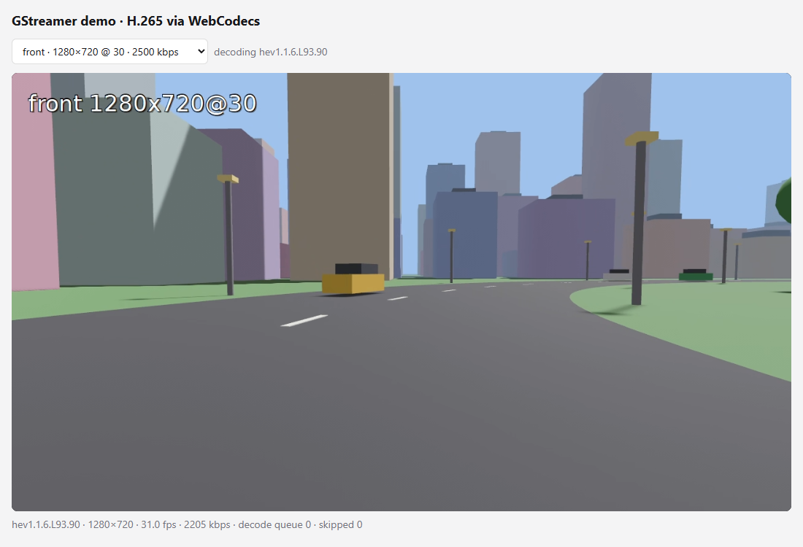

# bevy-streamer: streaming camera views from a Bevy 0.18 game

The same idea as [sim-streamer](../sim-streamer/), a car with cameras driving through a synthetic city, but
built as a normal **Bevy 0.18.1** app: ECS entities, PBR materials, a shadow-casting sun, fog, and a camera
rig parented to the car. Compared with sim-streamer's single atlas image:

- **Each camera renders into its own image**, with its own resolution and frame rate, and is streamed as its
  own H.265 channel.
- **Unwatched cameras aren't rendered at all.** A camera only renders while someone subscribes to its channel
  or to the mosaic, and idle channels also release their hardware encoder.
- **Cameras can be added and removed at runtime**, by clients (`add_camera` / `remove_camera`) or by the game
  itself (drone cameras appear every 30 s and live for 20 s). Watching clients are notified immediately.
- A **mosaic** channel shows every camera in a fixed 3×3 grid, built by GStreamer's `compositor`.





## How it's done in Bevy

You render to a texture. Bevy has everything built in, with no custom render-graph node:

| step | Bevy API | in this demo |
|---|---|---|
| 1. run **headless** | `WindowPlugin { primary_window: None, exit_condition: DontExit }`, `.disable::<WinitPlugin>()`, `ScheduleRunnerPlugin::run_loop(1/tick_fps)` | fixed tick rate (`--tick-fps`, default 30) |
| 2. **one render-target image per camera** | `Image::new_target_texture(w, h, Rgba8UnormSrgb, None)` + `TextureUsages::COPY_SRC` | each camera has its own size, e.g. front 1280×720, top 512×512 |
| 3. **camera → its image** | `RenderTarget::Image(handle.into())` component on the `Camera3d` | rig cameras are children of the car entity |
| 4. **GPU → CPU** | entity with `Readback::texture(handle)` + `.observe(\|ev: On<ReadbackComplete>\| …)` | the observer pushes the bytes into *that camera's* `appsrc` |
| 5. **render only what's needed** | `Camera::is_active` + inserting/removing the `Readback` component each tick | see below |
| 6. **→ GStreamer** | `gst_demo::streams::CameraStreams` | one `appsrc` → H.265 channel per camera, plus the compositor mosaic |

### Per-camera rates and on-demand rendering

Every tick the `schedule_cameras` system decides, for each camera, whether it renders on this tick:

```
wanted = own channel has subscribers || mosaic has subscribers   // CameraStreams::demand()
due    = tick % (tick_fps / camera_fps) == 0                      // 15 fps camera: every 2nd tick of 30
active = wanted && due
camera.is_active = active
if active { insert Readback::texture(image) } else { remove::<Readback>() }
```

- **Subscriber counts** come from the `tcpserversink`s (`num-handles`). `demand()` also opens and closes the
  mosaic feeds, so nothing is scaled or composited for a mosaic nobody watches.
- **Readback only on render ticks.** A `Readback` component reads its texture *every* frame. If it stayed
  attached while the camera was inactive, the stale image would be streamed again. Attaching it only on ticks
  where the camera renders makes sure each rendered frame is streamed exactly once. Camera and readback are
  extracted to the render world in the same frame, so they stay consistent.
- **What idle costs:** an inactive camera costs nothing in the render world: no culling, no shadow cascades,
  no draw calls, no readback. The simulation itself keeps running.
- **Idle encoders are stopped**, not just starved. A running hardware encoder keeps its session even
  without input. Measured: three channels watched once and then left kept 3 NVENC sessions open. Now the
  encoder element is set to `NULL` when the last subscriber leaves and restarted when one connects, so with
  nobody watching **0 sessions** are held. This matters on GeForce cards (about 8 sessions). The change is
  in the shared `wire_channel`, so all Rust producers in this repo benefit.

Measured with the default rig (GTX 1050):

| who is watching | cameras rendering (frames/s rendered and streamed) |
|---|---|
| nobody | none (`front idle \| rear idle \| … \| top idle`) |
| `rear` + `top` | rear 14.7/15, top 9.7/10, the other four idle |
| `mosaic` | front 29.6/30, rear/left/right 14.8/15, chase 29.6/30, top 9.8/10; mosaic arrives at 29.3 fps |

The console prints this table every 5 s.

## Dynamic cameras

### Adding and removing

From the command line, with [python/camctl.py](../../python/camctl.py), which needs only plain Python:

```bat
python python\camctl.py watch                                   :: live list of channel changes
python python\camctl.py add cctv1 --attach world --position 0 40 110 --look-at ego
python python\camctl.py add hood --attach ego --position 0 1.2 -1.5 --look-at forward --size 1280x720 --fps 30
python python\camctl.py add follow2 --attach car:2 --position 0 3 7 --look-at 0 1 -10 --lifetime 30
python python\camctl.py remove cctv1
```

From the browser: the [WebCodecs viewer](../../web/h265-webcodecs/) has an *Add a camera* form and a
*Remove camera* button. Its channel list updates live.

In code: send JSON to the control port:

```json
→ {"cmd":"add_camera","name":"cctv1","attach":"world","position":[0,40,110],"look_at":"ego",
   "width":640,"height":360,"fps":15,"kbps":800,"fov":60,"lifetime":20}
← {"ok":true,"channel":{"id":"cctv1","width":640,"height":360,"fps":15,"port":5008,...}}
→ {"cmd":"remove_camera","name":"cctv1"}
← {"ok":true}
```

| field | default | meaning |
|---|---|---|
| `name` | required | channel id: 1–24 chars of `a-z 0-9 _` (it ends up in GStreamer element names) |
| `attach` | `world` | `world`, `ego`, `car:N` (0–11), `drone:N` (0–5) |
| `position` | depends on `attach` | relative to the attach target; world coordinates for `world` |
| `look_at` | `ego` for world/drone, `forward` for cars | `[x,y,z]`, `forward`, or an anchor to track (`ego`, `car:N`, `drone:N`) |
| `width`, `height`, `fps`, `kbps` | 640, 360, 15, from pixels/s | width a multiple of 64; fps must divide `--tick-fps` |
| `fov` | 60 | vertical field of view in degrees |
| `lifetime` | none | remove automatically after N seconds of simulation time |

Errors come back as `{"ok":false,"error":"..."}`, e.g. a duplicate name, a bad fps, or the camera limit
being reached.

### Being notified

`{"cmd":"watch"}` returns the channel list (with `"watching": true`) and keeps the connection open. The
producer then pushes a line per change:

```json
{"event":"channel_added","channel":{"id":"dronecam_3","width":640,"height":360,"fps":15,"port":5009,...}}
{"event":"channel_removed","id":"dronecam_3"}
```

All clients in this repo use it:

- **Python and Rust receivers:** print changes and keep keys 1–9 current. If their own channel is removed,
  they fall back to the first channel instead of retrying a dead port.
- **WebCodecs viewer:** the Node relay forwards the events as Server-Sent Events (`/api/events`), and the page
  refreshes its channel list. Viewers of a removed channel are told (`{"type":"gone"}`) and switch to the
  mosaic.
- **`camctl.py watch`:** prints the changes.

Producers with a fixed channel list (`python/producer.py`, the Rust `producer`, `sim-streamer`) accept
`watch` as well; they just never send events.

### How it works inside

```
client ──add_camera──► control thread ──mpsc──► Bevy: apply_commands ──► Cameras::spawn
       ◄──reply─────── (waits ≤ 5 s) ◄────────── reply channel ◄──────┘     ├─ CameraStreams::add_camera (GStreamer)
                                                                           └─ image + Camera3d + Readback entity (Bevy)
```

- **Control server ([../src/lib.rs](../src/lib.rs)):** the channel list is live state behind a mutex.
  `add_channel` / `remove_channel` broadcast to watchers. Unknown commands go to an application handler, which
  here forwards them to Bevy and waits for the result, so the client gets a real answer (port, or an error).
- **GStreamer ([../src/streams.rs](../src/streams.rs)):**
  - **Adding:** each camera is its own `gst::Bin` (`appsrc → tee → channel / mosaic feed`), added to the
    *running* pipeline with `sync_state_with_parent`. Its mosaic output is a ghost pad linked to a
    compositor request pad at a free grid slot.
  - **Removing:** the bin is set to `NULL` (a source-only branch can just be stopped), the pad is unlinked and
    released, and the bin is removed. If anything fails half-way through adding, the bin is rolled back.
  - **Pools:** ports and mosaic slots come from pools and are reused.
- **The mosaic is a fixed grid:**
  - **Background:** a black `videotestsrc` (behind a valve, open only while the mosaic is watched) keeps the
    compositor running at a constant size and rate, so the mosaic's resolution never changes when cameras
    come and go.
  - **Latency:** because the background drives the output clock, the compositor gets 100 ms latency, so
    camera frames that arrive after readback and scaling are still used.
- **Bevy ([src/cameras.rs](src/cameras.rs)):**
  - **Tick rate:** fixed (`--tick-fps`), so new cameras never need a faster one.
  - **Validation before side effects:** a request's anchors are checked before anything is created.
  - **Attachment:** cameras rigidly mounted on a car are child entities. World, drone and tracking cameras are
    top-level entities with a `Follow` component, updated after the vehicles move.
  - **Despawning** removes the camera, its readback entity (and observer), its image and its GStreamer bin.
- **Scripted cameras:** `drone_director` adds a `dronecam_N` every `--drone-cam-every` seconds (default 30),
  hanging below a drone and tracking the red car, with a `--drone-cam-lifetime` (default 20 s).
  `expire_cameras` removes cameras whose lifetime is over.

Two GStreamer pitfalls hit while building this, and fixed:
- **Linking across bins:** a pad inside one bin can't be linked to a pad inside another bin without ghost
  pads ("Pads have no common grandparent"). The compositor therefore sits at the top level of the pipeline.
- **`bin_from_description(…, ghost_unlinked_pads = true)`** also ghosts `textoverlay`'s unused `text_sink`.
  `textoverlay` then waits for text that never comes, and the video freezes (black mosaic tiles). The ghost
  pad is now created explicitly for just the mosaic output.

### Limits and safety

- **`--max-cameras`** (default 9 = mosaic slots) caps the number of cameras. Each camera costs GPU memory for
  its render target and intermediate textures, and a hardware encoder session *while it is watched*.
- **Encoder sessions:** consumer GeForce cards allow about 8 simultaneous NVENC sessions. Idle channels hold
  none, so the limit applies to channels watched *at the same time*.
- **Ports:** cameras use `base-port + 1 … base-port + max-cameras`. Open that range in the firewall for remote
  receivers.
- **Security:** the control port is **unauthenticated**. Anyone who can reach it can add and remove cameras.
  Bind to `--host 127.0.0.1`, or firewall it, outside a trusted LAN.

## Run

Prerequisites are the same as the other Rust demos (GStreamer MSVC SDK *devel*, `env.cmd` / `env.ps1`).
Bevy is **not** in the workspace's default members because its first build takes several minutes:

```bat
cd rust
.\env.cmd
cargo build --release -p bevy-streamer      :: first build ≈ 5 min, later ones ≈ 1–2 min
target\release\bevy-streamer.exe
```

Startup channels (more appear at runtime):

| channel | resolution | fps | kbps | port |
|---|---|---|---|---|
| `mosaic` | 1920×1080 (3×3 tiles of 640×360) | 30 | 6000 | 5001 |
| `front` | 1280×720 | 30 | 2500 | 5002 |
| `rear`, `left`, `right` | 640×360 | 15 | 700 | 5003–5005 |
| `chase` | 960×540 | 30 | 1800 | 5006 |
| `top` | 512×512 | 10 | 600 | 5007 |
| dynamic cameras | as requested | | | 5008–5010 (pool) |

Watch it like any producer: `target\release\receiver.exe --channel front`, or in the browser with
`node server.js` in `web/h265-webcodecs`, then <http://localhost:8080/?channel=mosaic>.

Options:

| option | meaning |
|---|---|
| `--camera NAME=WxH@FPS[:KBPS]` (repeatable) | override a startup camera, e.g. `--camera front=1920x1080@30:4000` |
| `--tick-fps 30` | engine tick rate; every camera's fps must divide it |
| `--max-cameras 9` | camera limit (startup + dynamic) |
| `--drone-cam-every 30`, `--drone-cam-lifetime 20` | scripted drone cameras (`--drone-cam-every 0` turns them off) |
| `--no-mosaic` | don't offer the mosaic, so cameras render only for their own subscribers |
| `--mosaic-grid 3x3`, `--mosaic-tile 640x360`, `--mosaic-kbps 6000` | mosaic layout and bitrate |
| `--no-shadows` | cheaper rendering (every camera renders its own shadow cascades) |
| `--always-encode` | render and encode everything even without subscribers |
| `--host`, `--control-port`, `--base-port`, `--encoder`, `--gop-seconds` | as for the other producers |

Both Rust streamers default to ports 5000+. To run sim-streamer and bevy-streamer at the same time, give one
of them other ports (`--control-port 6000 --base-port 6001`) and point clients at them with
`--control-port 6000`.

## sim-streamer vs. bevy-streamer

| | sim-streamer (raw wgpu) | bevy-streamer (Bevy 0.18) |
|---|---|---|
| scene | flat-shaded instanced boxes, fake fog | PBR, sun with shadow cascades, fog, MSAA |
| images | one atlas, one readback for all cameras | one image and one readback per camera |
| per-camera resolution and rate | no (same tile size and rate) | yes |
| unwatched cameras | still rendered (only encoding stops) | not rendered |
| cameras at runtime | fixed | added and removed by clients or the game |
| mosaic | the atlas itself | GStreamer `compositor`, fixed grid |
| GStreamer side | `gst_demo::atlas` | `gst_demo::streams` |
| code size | ~600 lines incl. renderer | ~900 lines (scene, camera lifecycle, glue) |
| build time | seconds | minutes the first time |

## Files

| file | what |
|---|---|
| [src/main.rs](src/main.rs) | headless app, command handler (control thread → Bevy), `schedule_cameras` (demand + rate), reporting, exit |
| [src/cameras.rs](src/cameras.rs) | camera lifecycle: `add_camera` request parsing, anchors, spawn/despawn, `Follow` cameras, drone director, expiry |
| [src/scene.rs](src/scene.rs) | world (road, city, park, traffic, drones, lighting), `Lane` driving, the startup `CameraDef`s |
| [../src/streams.rs](../src/streams.rs) | shared GStreamer side: camera bins added/removed at runtime, port and slot pools, fixed-grid mosaic, `demand()` |
| [../src/lib.rs](../src/lib.rs) | control server with live channel list, `watch` events, command handler hook; encoder wiring |
| [../../python/camctl.py](../../python/camctl.py) | command-line client: list, watch, add, remove |

## Going further

- **Zero-copy:** instead of `Readback`, a render-graph node can hand the camera's `GpuImage` texture to
  NVENC through D3D12/Vulkan interop.
- **Depth or segmentation** for ML: add `DepthPrepass` or custom passes and read them back as raw buffers
  (not video). See the [sim-streamer README](../sim-streamer/README.md#is-this-the-right-approach).
- **Pause the simulation** when nobody watches anything at all, if the world doesn't need to keep running.
- **Move or retarget a camera** at runtime (`update_camera`), and send per-frame metadata (pose, sim time)
  alongside the video.
- **Authentication** for the control port (a shared token in each request) before exposing it beyond a LAN.
