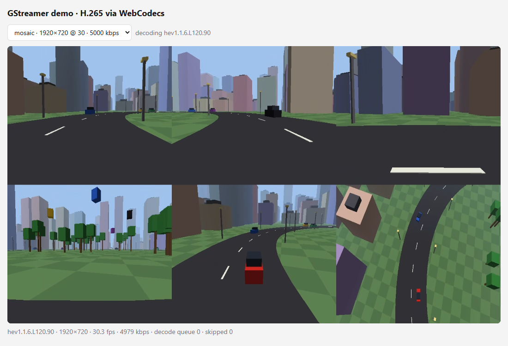
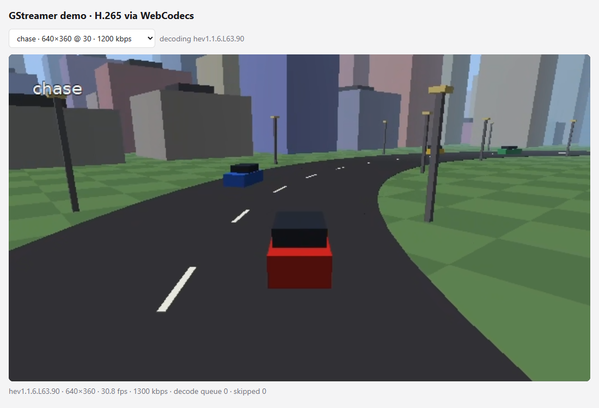

# Streaming rendered 3D views from a Rust engine

This document has two parts: notes on the idea (a game/simulation engine renders several camera views
headlessly and streams them as video), and a small working demo, `sim-streamer`.



## TL;DR

- **Yes, it's possible, and the architecture is sound.** It's the same pattern as Unreal Engine's Pixel
  Streaming, cloud gaming, and the camera sensors of driving simulators (CARLA, AirSim). The engine renders
  offscreen, frames go into an encoder, and the encoder output goes to the network.
- **Several low-resolution cameras are cheap.** Six 640×360 views are 1.4 MP per frame, fewer pixels than a
  single 1080p frame. Rendering cost grows mainly with *draw calls × views*, so render all views in one pass.
- **The bottlenecks are usually**, in order:
  1. the GPU→CPU copy and its synchronisation
  2. the number of hardware encoder sessions
  3. colour conversion on the CPU
  4. the scene's draw cost per view

  All four have well-known fixes, listed below.
- **Who consumes the video matters most.** For *people* (monitoring, tele-operation, demos), H.265/H.264
  streaming is the right tool. For *algorithms* (perception, ML training, autonomy stacks), lossy video
  changes the data. There you'd rather ship raw or lossless frames, or skip the network entirely. See
  "Is this the right approach?".
- **The demo:** about 600 lines of Rust render a synthetic city with a car carrying 6 cameras, and stream
  7 H.265 channels: 6 cameras plus a mosaic. On a GTX 1050 it takes about 6 ms per frame for all six views,
  including readback. All existing receivers (Python, Rust, browser) work with it unchanged.

## Architecture

```
 ┌──────────────────────── one engine process ───────────────────────────────────────────────┐
 │                                                                                           │
 │  simulation tick ─► render N cameras ─► GPU→CPU readback ─► appsrc ─► tee ─┬─► encode ─► net  │  channel "mosaic"
 │   (fixed dt)       (1 pass, N viewports    (1 copy/frame)     (GStreamer)   ├─► crop ─► encode ─► net │  channel "front"
 │                     into one atlas)                                          └─► …               │  …
 │                                                                                           │
 │  control server: "which channels exist?"  (same JSON protocol as the rest of this repo)   │
 └───────────────────────────────────────────────────────────────────────────────────────────┘
         subscribers: python/receiver.py · rust receiver · browser (web/h265-webcodecs, web/webrtc)
```

Design choices in the demo, and why:

| choice | why |
|---|---|
| **All cameras in one atlas texture**, one viewport per camera | one render pass, one readback, one buffer handed to GStreamer per frame; all views come from the *same simulation tick* by construction |
| **GStreamer in-process via `appsrc`** | lowest latency, no extra copies or IPC; reuses the encoders, muxers, and network sinks from the rest of the repo |
| **Per-camera channels cut out of the atlas** (`videocrop`) *after* the valve | channels nobody watches cost nothing (no crop, no encode) |
| **A mosaic channel** | one encoder session for all views, which matters with encoder session limits (below) |
| **Simulation time = frame / fps** | deterministic; if rendering is too slow the stream drops frames, but the simulation doesn't jitter |
| **Render thread separate from the GStreamer main loop** | the engine never blocks on networking; `appsrc` is leaky (max 2 frames) |

## Performance considerations

### 1. Rendering N views

- Pixel cost scales with total pixels: 6 × 640×360 ≈ 1.4 MP, less than 1080p (2.1 MP).
- Geometry and CPU cost scale with *views × draw calls*. Mitigations:
  - render all views in one pass, as in the demo
  - instancing (the demo draws the whole scene with one instanced draw per camera)
  - frustum culling per camera
  - LOD for distant objects
  - share shadow maps between cameras (one sun, many cameras)
- `wgpu` also supports *multiview*, rendering into array layers in a single draw, if the views share
  resolution.
- Measured in the demo: **≈ 6 ms per frame for 6 cameras on a GTX 1050**, including readback, out of a 33 ms
  budget at 30 fps. A real game scene costs more per view, but the structure stays the same.

### 2. GPU → CPU readback

- Bandwidth is not the problem: 1920×720 RGBA at 30 fps is about 166 MB/s, a tiny fraction of PCIe.
- **Synchronisation** is the problem. The demo waits for the GPU each frame (`map_async` + `poll(Wait)`),
  which serialises CPU and GPU. Fixes:
  - **ring of 2–3 readback buffers**: map frame *n−2* while the GPU renders frame *n*. Easy, and it removes
    the stall.
  - **zero-copy:** share the rendered texture with the encoder directly, with no readback. NVENC and
    GStreamer's D3D12/CUDA elements accept GPU memory (`video/x-raw(memory:D3D12Memory)`). In `wgpu` you
    reach the native resource through `as_hal`, then wrap it for GStreamer. This is the most work and gives
    the best result.

### 3. Colour conversion

- Renderers output RGBA, and encoders want YUV 4:2:0.
- `nvh265enc` accepts RGBA and converts on the GPU, which is free. In the demo, `videoconvert` then passes the
  frames through untouched.
- With `x265enc` (CPU) the conversion also runs on the CPU, which costs noticeably more than the render itself.

### 4. Encoders

- **Session limits:** consumer GeForce cards allow a limited number of simultaneous NVENC sessions (8 at the
  time of writing). Professional and datacenter GPUs (RTX A-series, L4, …) are effectively unlimited.
  Each channel is one session. Ways to handle it:
  - encode **on demand**: the demo opens a channel's valve only while someone watches, and stops the
    encoder element while nobody does. A running NVENC encoder holds its session even without input; with
    this, idle channels hold 0 sessions
  - stream a **mosaic** and let receivers crop
  - spread channels over several GPUs
- **Throughput** is roughly pixels per second. 6 × 360p30 is about 41 Mpx/s, well within one NVENC
  (1080p60 alone is about 124 Mpx/s).
- **Low-latency settings:** no B-frames, CBR, short GOP, forced keyframe on join. These are already in
  `gst_demo::encoder_props`.

### 5. Latency budget (LAN, typical)

| stage | time |
|---|---|
| simulate + render | 5–16 ms |
| readback (with ring buffer) | 1–3 ms |
| NVENC low-latency encode | 2–5 ms |
| network (LAN) | < 1–5 ms |
| receiver jitter buffer + decode | 5–30 ms |
| display | up to 1 refresh |
| **glass-to-glass** | **about 30–80 ms** |

WebRTC is similar. HLS/DASH add seconds.

### 6. Synchronising cameras and metadata

- With an atlas, all cameras come from one tick, and every channel's frame carries the same timestamp.
  A receiver can match frames across channels by PTS.
- Consumers usually also need **metadata**: simulation time, vehicle pose, camera intrinsics and extrinsics.
  Options:
  - H.265 SEI user-data messages, which travel inside the video
  - GStreamer custom metas plus a side channel
  - extending the JSON control protocol with a per-frame metadata stream

## Is this the right approach?

| consumer | recommendation |
|---|---|
| **People**: tele-operation, monitoring, dashboards, remote demos | ✅ this architecture: H.265/H.264, low-latency settings, TCP/RTP on a LAN, WebRTC for browsers |
| **Many remote viewers of the same views** | ✅ encode once, fan out (like [web/h265-webcodecs](../../web/h265-webcodecs/)), or WebRTC through an SFU |
| **Perception / ML / autonomy stack** (simulated sensors) | ⚠️ lossy 4:2:0 video changes pixels, so a model trained or tested on it sees compression artifacts. Prefer raw frames (shared memory, ROS 2 `sensor_msgs/Image`, zero-copy IPC like iceoryx2), or at least very high quality / lossless / 4:4:4 encoding. **Depth, segmentation, and normals buffers must not go through a video codec.** Use raw data or lossless compression (zstd, PNG, 16-bit). This is what CARLA and Isaac Sim do |
| **Consumer on the same machine and GPU** | skip encoding altogether and share GPU memory (CUDA/D3D12/Vulkan interop) |
| **Record datasets** | write losslessly or at high quality to disk (`splitmuxsink`); don't stream |

A practical structure for a real engine:

1. Keep the engine side narrow: *"here is a frame (GPU texture or CPU buffer) + metadata for camera X at
   tick T"*.
2. Put the streaming layer behind that interface: in-process GStreamer like here, or a separate process fed
   through shared memory (`shmsink`/`shmsrc`, `unixfdsink` on Linux). A separate process isolates crashes
   and lets you restart or scale streaming independently.
3. Scale out with **one engine instance per vehicle or scenario** on GPU servers, and treat each instance as a
   producer with its own control port. Receivers already discover channels dynamically.

## The demo: `sim-streamer`

A synthetic world built only from boxes, on purpose: one cube mesh, instanced. It contains:

- a ring road with lane markings and lamp posts, a city around it, and a park with trees inside
- oncoming and same-direction traffic, plus spinning "drones"
- a red ego car carrying **6 cameras**: `front`, `rear`, `left`, `right` (90° each, which together cover
  360°), `chase` (third person), and `top` (bird's-eye)



Channels (same control protocol as the producer, so `--list` works):

| channel | resolution | port |
|---|---|---|
| `mosaic` | 1920×720 (3×2 tiles) | 5001 |
| `front`, `rear`, `left`, `right`, `chase`, `top` | 640×360 each | 5002–5007 |

### Build and run

Prerequisites are the same as the Rust producer: the GStreamer MSVC SDK *devel* install, plus `env.cmd` /
`env.ps1` in your shell. See the main [README](../../README.md#3-rust-install-build-run). `wgpu` picks
Vulkan or D3D12 automatically, and any GPU from the last ~8 years works.

```bat
cd rust
.\env.cmd                                  :: PowerShell: . .\env.ps1
cargo build --release                      :: builds producer, receiver and sim-streamer
target\release\sim-streamer.exe
```

Then watch it with any receiver:

```bat
target\release\receiver.exe --channel mosaic
python ..\python\receiver.py --channel chase          :: from the repo's venv
```

Or in a browser, which needs no install beyond Node: `cd web\h265-webcodecs && node server.js`, then open
<http://localhost:8080/?channel=mosaic>.

Options: `--cam-width 640 --cam-height 360` (width must be a multiple of 64 because of GPU copy alignment),
`--cols 3`, `--fps 30`, `--cam-kbps 1200`, `--mosaic-kbps 5000`, `--encoder auto|nvenc|x265|…`,
`--gop-seconds 1`, `--always-encode`, `--base-port`, `--control-port`.

The console prints render statistics every 5 s, for example:
`render: 30.0 fps, 5.9 ms/frame for 6 cameras (render + readback + push)`.

### Code tour

| file | what |
|---|---|
| [src/scene.rs](src/scene.rs) | the world: static boxes, traffic, ego vehicle, and the 6 `CameraDef`s (mount point, yaw/pitch, FOV) |
| [src/render.rs](src/render.rs) | headless `wgpu`: one pipeline, instanced cube, a viewport per camera into the atlas, synchronous readback |
| [src/shader.wgsl](src/shader.wgsl) | instanced vertex shader, Lambert lighting, checker ground, distance fog |
| [src/main.rs](src/main.rs) | render thread with real-time pacing, pushes each atlas into the shared streamer |
| [../src/atlas.rs](../src/atlas.rs) | shared with bevy-streamer: the GStreamer pipeline (`appsrc` → `tee` → mosaic / `videocrop` per camera), channels, control server |
| [../src/lib.rs](../src/lib.rs) | shared with the producer: encoder settings, `channel_branch` (valve → encoder → MPEG-TS → TCP), encode-on-demand wiring, control server |

### Where to take it next

- Use a readback ring buffer, then zero-copy D3D12/Vulkan → NVENC.
- Give cameras independent resolutions or rates: render several atlases, or render each camera to its own
  texture and use one `appsrc` per camera.
- Send per-frame metadata (pose, sim time) as SEI or on a side channel.
- Add lossless depth and segmentation outputs for ML consumers, as raw buffers and not video.
- Pause rendering of cameras nobody subscribes to: the `stats` command already reports subscribers per
  channel.
- For the same demo built on a game engine, see [bevy-streamer](../bevy-streamer/) (Bevy 0.18).
